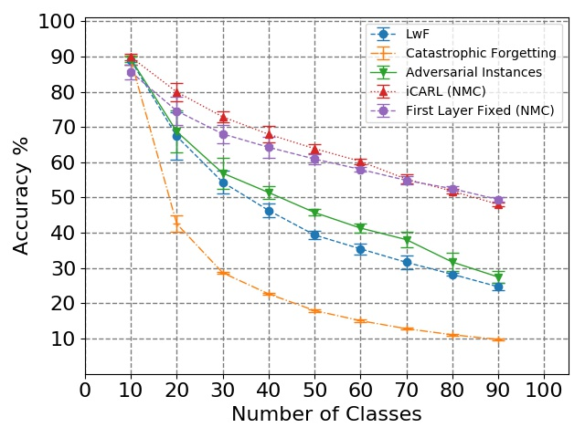

# Privacy Preserving Incremental Learning
In this branch, we implement multiple approaches to do privacy preserving incremental learning. This is in contrast to conventional methods which violate the privacy requirement by either storing real instances as exemplars (i.e. iCARL[1]) or by generating new instances which look visually similar to the real ones (i.e. GAN-based architectures).

## Approaches 
1. Generate and use adversarial instances as exemplars for each of the previously learned classes. In the current implementation, Fast Sign Gradient Method[2] is used, and the L1 distance is minimized between features (at different model layers) of adversarial and real instances. The idea is that generated adversarial instances will visually look like random noise, but might contain the discriminatory information required to learn a good classifier. 

2. Instead of storing exemplars, store their features outputted by the first layer of the model and then freeze the model upto that layer. The idea is that parameters learned by initial layers of the model at first increment are good enough to be used during all increments. Note that this increases the memory requirement by a constant factor, depending upon the size of feature vector used. 

## Results 
Results generated on CIFAR100 with a step-size of 10 and a memory-budget of 2000. Note that;

1. Catastrophic Forgetting is the vanilla method used for incremental learning in which classes are incrementally learned by fine-tuning the model at each subsequent increment. 
2. LwF uses distillation loss to prevent some of the adverse affects of fine-tuning but does not rely on any exemplars from previous classes.
3. iCARL also uses distilattion loss but does rely on exemplars and is therefore not privacy preserving. The results are plotted here only for a reference.  

To reproduce these results, overwrite few of the default parameters with either **--store_features --lr=0.5** or **--adversarial** or **--lwf**. 

## References
[1] Incremental Classifier and Representation Learning https://arxiv.org/abs/1611.07725

[2] Explaining and Harnessing Adversarial Examples https://arxiv.org/abs/1412.6572
